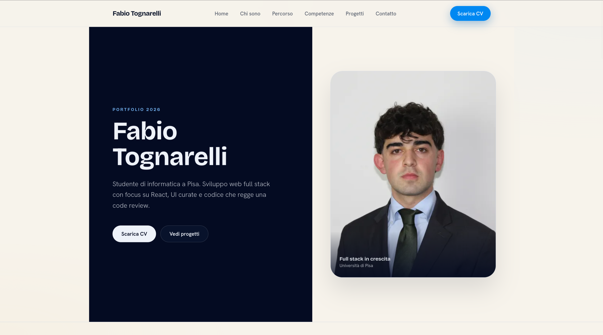
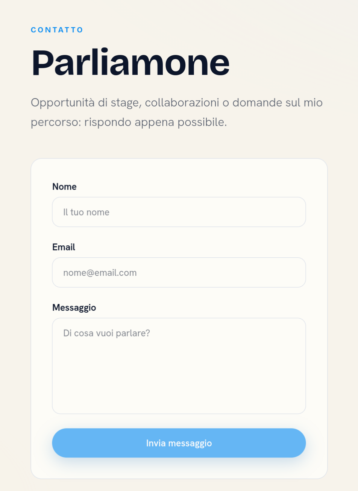

# Fabio Tognarelli - Portfolio Personale

[](https://fabiotognaa-personal-portfolio.vercel.app)

## 👋 Introduzione

Benvenuto nel repository del mio portfolio personale!

Ho sviluppato questo sito web per presentarmi professionalmente e raccogliere i miei progetti in un unico spazio. Attualmente, come studente accademico, il mio obiettivo principale era creare una **Proof of Work** concreta che dimostrasse le mie competenze di sviluppo Frontend, fungendo contemporaneamente da vetrina per i miei lavori futuri.

Il progetto è costruito con un approccio moderno, pulito e focalizzato sulle performance.

## ✨ Funzionalità Principali

- **Architettura a Componenti:** Struttura modulare basata su React per la massima manutenibilità.

- **Download CV:** Accesso diretto al curriculum vitae aggiornato.

- **Form di contatto:** Pagina dedicata con invio messaggi tramite [Web3Forms](https://web3forms.com/).

## 🛠️ Tech Stack

Ecco le tecnologie e gli strumenti utilizzati per realizzare questo progetto:

| Categoria           | Tecnologie                                     |
| :------------------ | :--------------------------------------------- |
| **Build Tool**      | Vite                                           |
| **Frontend**        | React, React Router, Tailwind CSS, Headless UI |
| **Form di contatto**| Web3Forms                                      |
| **Version Control** | Git & GitHub                                   |
| **Deployment**      | Vercel                                         |

## 📸 Anteprima

### Desktop View




### Contact Page




### Project Page

_Screenshot in arrivo._

## 🚀 Come avviare il progetto in locale

Come far girare questo progetto in locale:

**Prerequisiti:**
Assicurati di avere installato [Node.js](https://nodejs.org/) e [pnpm](https://pnpm.io/) (il repo dichiara `pnpm@10.32.0` in `package.json`).

1.  **Clona il repository:**

    ```bash
    git clone https://github.com/FabioTognaa/fabiotognaa-personal-portfolio.git
    ```

2.  **Entra nella cartella:**

    ```bash
    cd fabiotognaa-personal-portfolio
    ```

3.  **Installa le dipendenze:**

    ```bash
    pnpm install
    ```

4.  **Avvia il server di sviluppo:**

    ```bash
    pnpm dev
    ```

5.  Apri il browser su `http://localhost:5173` (o sull'URL indicato nel terminale).

### Altri comandi utili

| Comando               | Descrizione                         |
| :-------------------- | :---------------------------------- |
| `pnpm build`          | Build di produzione in `dist/`      |
| `pnpm preview`        | Anteprima locale della build        |
| `pnpm lint`           | Controllo ESLint                    |
| `pnpm deploy`         | Build + deploy produzione su Vercel |
| `pnpm deploy:preview` | Build + deploy preview su Vercel    |

### Quality gate

Prima di chiudere modifiche non banali, esegui:

```bash
pnpm build
pnpm lint
pnpm audit --audit-level high
```

La stessa catena gira in GitHub Actions su pull request e push verso `main` tramite `.github/workflows/quality-gate.yml`.

Limiti attuali: il progetto non ha TypeScript/typecheck né un test framework configurato. Questi controlli non vanno considerati coperti finché non vengono aggiunti esplicitamente.

## 📂 Struttura del Progetto
```text
├── Frontend/
│   ├── index.html
│   ├── public/                     # asset statici (URL assoluti /)
│   │   ├── documents/
│   │   │   └── cv-tognarelli-fabio.pdf
│   │   └── images/
│   │       ├── profile/
│   │       │   └── tognarelli-*.webp
│   │       └── logos/
│   │           ├── fermi-*.webp
│   │           └── unipi-*.webp
│   ├── docs/
│   │   └── screenshots/            # solo README, non nel build
│   │       ├── desktop-preview.png
│   │       └── form-preview.png
│   ├── src/
│   │   ├── assets/
│   │   │   └── icons/skills/       # icone skill (import Vite, lazy load)
│   │   ├── components/
│   │   │   ├── layout/
│   │   │   ├── pages/
│   │   │   └── ui/
│   │   ├── hooks/
│   │   ├── lib/
│   │   │   └── static-assets.js    # path pubblici centralizzati
│   │   ├── main.jsx
│   │   └── index.css
│   └── dist/                      # output build (generato)
│
├── package.json
├── pnpm-lock.yaml
├── pnpm-workspace.yaml          # override pnpm per patch di sicurezza transitive
├── vite.config.js
├── eslint.config.js
├── .github/workflows/quality-gate.yml
├── .cursor/                    # agenti, rules e quality gate del pilot
├── .prettierrc
└── vercel.json
```

**Asset non-code:** foto, loghi e PDF in `public/`; icone skill in `src/assets/icons/skills/` (bundled da Vite). Gli URL pubblici sono definiti in `src/lib/static-assets.js`.

## Contatti

Se hai domande o vuoi collaborare, non esitare a contattarmi!

Website: https://fabiotognaa-personal-portfolio.vercel.app

LinkedIn: https://www.linkedin.com/in/fabio-tognarelli/

Email: fabiotognaa@gmail.com