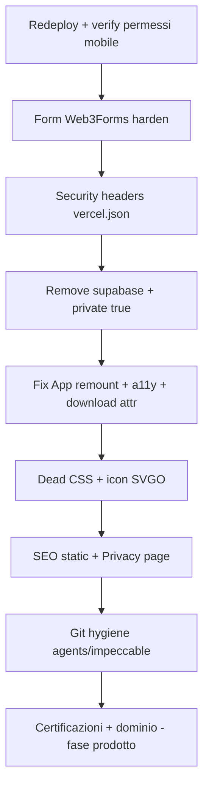

# Audit portfolio: problemi e piano di remediation

## Contesto

SPA React/Vite su Vercel, senza backend proprio. Form via Web3Forms. Nessun analytics/cookie di tracking. Bundle già ragionevole (~1.1MB dist, lazy routes, WebP). I problemi rilevati non sono “il sito è rotto”, ma **trust mobile, abuso form, debito tecnico e SEO/a11y**.

---

## 1. Critico — Trust mobile / “permessi da virus”

### Causa root (già quasi risolta)

Nel commit `4593198` è stato rimosso da [`Frontend/index.html`](Frontend/index.html) lo script **Impeccable Live**:

```html
<script src="http://localhost:8400/live.js"></script>
```

In produzione quel tag faceva sì che il browser tentasse di caricare uno script da `localhost` (e il tool live può toccare clipboard/API sensibili). Su mobile compare come comportamento sospetto / “sito che chiede cose strane”.

### Cosa fare

1. **Redeploy produzione** (`pnpm deploy`) e verifica su telefono reale: nessun prompt anomalo all’apertura.
2. **Prevenire la regressione**: in [`vite.config.js`](vite.config.js) (o script prebuild) fallire la build se `index.html` contiene `localhost:8400` / `impeccable-live`.
3. Se i prompt restano dopo il redeploy: catturare screenshot + browser/OS (potrebbero essere solo dialoghi nativi di `tel:` / download PDF — legittimi, da spiegare in UI, non “permessi”).

---

## 2. Alto — Sicurezza form di contatto

In [`Frontend/src/components/pages/ContactPage.jsx`](Frontend/src/components/pages/ContactPage.jsx):

- `access_key` Web3Forms **hardcoded** nel client (inevitabile per Web3Forms, ma oggi senza protezioni).
- Nessun honeypot / captcha / rate-limit lato client.
- Chiunque può spammarte la inbox con quella key.

### Cosa fare

1. Spostare la key in `VITE_WEB3FORMS_ACCESS_KEY` (repo root `.env`, documentata in `.env.example`); su Vercel impostare la env di progetto.
2. Nel dashboard Web3Forms: **domain allowlist** sul dominio Vercel (e futuro custom).
3. Aggiungere honeypot nascosto (`botcheck` / campo nascosto) come da docs Web3Forms.
4. Opzionale ma consigliato: attivare reCAPTCHA/hCaptcha nel pannello Web3Forms.
5. Validazione: lunghezza max messaggio, trim, honeypot deve restare vuoto.

---

## 3. Alto — Security headers mancanti

[`vercel.json`](vercel.json) oggi ha solo lo SPA rewrite. Nessun header di hardening.

### Cosa fare

Aggiungere in `vercel.json` (headers su `/(.*)`):

- `Content-Security-Policy` (baseline: `default-src 'self'`; `script-src 'self'`; `connect-src 'self' https://api.web3forms.com`; `img-src 'self' data:`; `style-src 'self' 'unsafe-inline'` per Tailwind runtime; `font-src 'self'`; `frame-ancestors 'none'`; `base-uri 'self'`; `form-action 'self' https://api.web3forms.com`)
- `X-Content-Type-Options: nosniff`
- `Referrer-Policy: strict-origin-when-cross-origin`
- `Permissions-Policy: camera=(), microphone=(), geolocation=(), payment=()` (rinforza il punto “permessi”)
- `X-Frame-Options: DENY` (o solo CSP `frame-ancestors`)

Verificare post-deploy che form e font/icone funzionino ancora.

---

## 4. Medio — Igiene dipendenze e supply chain

| Problema                                                                                                  | Evidenza                                                                          | Fix                                                                                                                                                                                                                                     |
| --------------------------------------------------------------------------------------------------------- | --------------------------------------------------------------------------------- | --------------------------------------------------------------------------------------------------------------------------------------------------------------------------------------------------------------------------------------- |
| `@supabase/supabase-js` inutilizzato                                                                      | in `package.json`, zero import in `Frontend/` (rimosso col passaggio a Web3Forms) | `pnpm remove @supabase/supabase-js`                                                                                                                                                                                                     |
| `"private": false`                                                                                        | [`package.json`](package.json)                                                    | `"private": true`                                                                                                                                                                                                                       |
| Audit CLI: `tar` (critical via `vercel`), `brace-expansion` (eslint), advisory RSC CSRF su `react-router` | `pnpm audit`                                                                      | aggiornare override in [`pnpm-workspace.yaml`](pnpm-workspace.yaml) dove possibile; **non** trattare l’advisory RSC come exploitabile (usi `BrowserRouter`, non RSC mode). `vercel` resta solo toolchain locale — impatto browser nullo |
| README mente su CI                                                                                        | cita `.github/workflows/quality-gate.yml` assente                                 | allineare README **oppure** aggiungere workflow minimo `pnpm build && pnpm lint && pnpm audit`                                                                                                                                          |

---

## 5. Medio — Igiene Git / repo pubblico

- [`.gitignore`](.gitignore) ignora `.agents*` / `.impeccable*` ma **83 file sono ancora tracked** → `git rm -r --cached .agents .impeccable` (se intendi tenerli fuori dal repo pubblico) **oppure** togliere le regole di ignore e tenere solo i skill necessari.
- [`certificates/claude-101.pdf`](certificates/claude-101.pdf) è nel repo pubblico ma **non** in `Frontend/public` → non è servito; o lo sposti in `public/certificates/` quando implementi la sezione, o lo tieni fuori da git fino ad allora.
- Screenshot README ~825KB in `Frontend/docs/screenshots/` (ok se non nel build; eventualmente comprimere).

---

## 6. Medio — Performance / UX runtime

### Remount totale ad ogni navigazione

[`Frontend/src/components/App.jsx`](Frontend/src/components/App.jsx):

```jsx
<div key={location.pathname} className="page-enter">
```

Questo **distrugge e ricrea** header, footer, listener scroll e drawer a ogni route. Costo inutile.

**Fix:** animare solo `<Outlet>` / contenuto pagina (wrapper interno con key), non l’intero shell. Tenere `PageShell` stabile.

### Altri fix snelli

- `Suspense fallback={null}` → skeleton/min-height leggero per evitare flash bianco.
- Import morti: `PageShell` in [`HomePage.jsx`](Frontend/src/components/pages/HomePage.jsx) e [`PageNotFound.jsx`](Frontend/src/components/pages/PageNotFound.jsx).
- `download={CV_PATH}` ovunque (header/footer/home): l’attributo `download` deve essere un **filename** (`cv-tognarelli-fabio.pdf`), non il path URL.
- CSS morto in [`Frontend/src/index.css`](Frontend/src/index.css): `.expand-panel*`, `.study-expand-trigger`, `.site-header__brand`, `.skills-hint` (e valutare `.skip-link` solo dopo aver aggiunto il markup).
- Icone skill pesanti (`c-icon.svg` 27KB, `java` 20KB, ecc.): SVGO / SVG semplificati; PNG → WebP/SVG dove possibile.
- Opzionale: dynamic import di `@headlessui` + heroicons solo nel drawer mobile (oggi finiscono in `ui-vendor` sul critical path).

---

## 7. Medio — Accessibilità

- CSS `.skip-link` esiste, markup assente → aggiungere link “Vai al contenuto” in [`PageShell.jsx`](Frontend/src/components/layout/PageShell.jsx) verso `#main-content`.
- [`AboutPage.jsx`](Frontend/src/components/pages/AboutPage.jsx) / Skills: heading parte da `h2` senza `h1` → promuovere a `h1`.
- [`StudyPage.jsx`](Frontend/src/components/pages/StudyPage.jsx): due `h1` → un `h1` pagina + `h2` per sezioni.
- [`SkillGroupCard.jsx`](Frontend/src/components/ui/SkillGroupCard.jsx): `<button>` senza azione → `<span>` (evita tab stop inutili e falsa interattività).

---

## 8. Basso/Medio — SEO e trust professionale

Mancano: favicon, `robots.txt`, `sitemap.xml`, `canonical`, `twitter:card`, meta per-route (SPA limitata: almeno statici solidi in `index.html` + file pubblici).

### Cosa fare

1. Favicon + apple-touch-icon in `Frontend/public/`.
2. `robots.txt` + `sitemap.xml` con URL canoniche (oggi `*.vercel.app`; aggiornare quando c’è dominio custom).
3. `link rel="canonical"` e `twitter:card` in [`Frontend/index.html`](Frontend/index.html).
4. Opzionale successivo: `react-helmet-async` o titolo dinamico per route.

---

## 9. Cookie policy / privacy (risposta ROADMAP)

**Cookie banner: non serve** finché non usi cookie/localStorage di tracking/analytics/ads. Oggi non risultano.

**Serve invece** una pagina leggera **Privacy** (gratis, markdown/JSX statico) che dichiari:

- nessun cookie di profilazione;
- il form invia nome/email/messaggio a Web3Forms (terza parte) per risponderti;
- email/telefono/CV pubblicati volontariamente;
- link alla privacy di Web3Forms.

Rischio legale concreto senza cookie banner: **basso**. Rischio senza alcuna informativa sul trattamento dei dati del form: **medio-basso** (soprattutto se ricevi molte candidature/contatti).

Footer: link “Privacy”.

---

## 10. Fuori da questa remediation (ROADMAP prodotto)

- **Dominio custom**: sì, migliora trust e toglie “sito-Vercel”; va fatto in Vercel Domains + aggiornamento OG/canonical/sitemap.
- **Sezione certificazioni Anthropic**: spostare PDF in `Frontend/public/certificates/`, entry in una lib tipo `lib/certificates.js`, pagina o blocco in Studies — dopo i fix sopra.

---

## Ordine di esecuzione consigliato



### Verifica a ogni fase

```bash
pnpm build && pnpm lint && pnpm audit --audit-level high
```

Poi smoke test: home, contact submit, download CV, navigazione mobile, header CSP non rompe asset.
