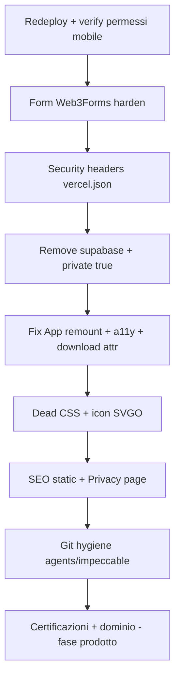

# Audit portfolio: problemi e piano di remediation

## Contesto

SPA React/Vite su Vercel, senza backend proprio. Form via Web3Forms. Nessun analytics/cookie di tracking. Bundle già ragionevole (~1.1MB dist, lazy routes, WebP). I problemi rilevati non sono “il sito è rotto”, ma **trust mobile, abuso form, debito tecnico e SEO/a11y**.

---

## 3. Alto — Security headers mancanti

[`vercel.json`](vercel.json) oggi ha solo lo SPA rewrite. Nessun header di hardening.

### Cosa fare

Aggiungere in `vercel.json` (headers su `/(.*)`):

- `Content-Security-Policy` (baseline: `default-src 'self'`; `script-src 'self'`; `connect-src 'self' https://api.web3forms.com`; `img-src 'self' data:`; `style-src 'self' 'unsafe-inline'` per Tailwind runtime; `font-src 'self'`; `frame-ancestors 'none'`; `base-uri 'self'`; `form-action 'self' https://api.web3forms.com`)
- `X-Content-Type-Options: nosniff`
- `Referrer-Policy: strict-origin-when-cross-origin`
- `Permissions-Policy: camera=(), microphone=(), geolocation=(), payment=()` (rinforza il punto “permessi”)
- `X-Frame-Options: DENY` (o solo CSP `frame-ancestors`)

Verificare post-deploy che form e font/icone funzionino ancora.

---

## 6. Medio — Performance / UX runtime

### Remount totale ad ogni navigazione

[`Frontend/src/components/App.jsx`](Frontend/src/components/App.jsx):

```jsx
<div key={location.pathname} className="page-enter">
```

Questo **distrugge e ricrea** header, footer, listener scroll e drawer a ogni route. Costo inutile.

**Fix:** animare solo `<Outlet>` / contenuto pagina (wrapper interno con key), non l’intero shell. Tenere `PageShell` stabile.

### Altri fix snelli

- `Suspense fallback={null}` → skeleton/min-height leggero per evitare flash bianco.
- Import morti: `PageShell` in [`HomePage.jsx`](Frontend/src/components/pages/HomePage.jsx) e [`PageNotFound.jsx`](Frontend/src/components/pages/PageNotFound.jsx).
- `download={CV_PATH}` ovunque (header/footer/home): l’attributo `download` deve essere un **filename** (`cv-tognarelli-fabio.pdf`), non il path URL.
- CSS morto in [`Frontend/src/index.css`](Frontend/src/index.css): `.expand-panel*`, `.study-expand-trigger`, `.site-header__brand`, `.skills-hint` (e valutare `.skip-link` solo dopo aver aggiunto il markup).
- Icone skill pesanti (`c-icon.svg` 27KB, `java` 20KB, ecc.): SVGO / SVG semplificati; PNG → WebP/SVG dove possibile.
- Opzionale: dynamic import di `@headlessui` + heroicons solo nel drawer mobile (oggi finiscono in `ui-vendor` sul critical path).

---

## 8. Basso/Medio — SEO e trust professionale

Mancano: favicon, `robots.txt`, `sitemap.xml`, `canonical`, `twitter:card`, meta per-route (SPA limitata: almeno statici solidi in `index.html` + file pubblici).

### Cosa fare

1. Favicon + apple-touch-icon in `Frontend/public/`.
2. `robots.txt` + `sitemap.xml` con URL canoniche (oggi `*.vercel.app`; aggiornare quando c’è dominio custom).
3. `link rel="canonical"` e `twitter:card` in [`Frontend/index.html`](Frontend/index.html).
4. Opzionale successivo: `react-helmet-async` o titolo dinamico per route.

---

## 9. Cookie policy / privacy (risposta ROADMAP)

**Cookie banner: non serve** finché non usi cookie/localStorage di tracking/analytics/ads. Oggi non risultano.

**Serve invece** una pagina leggera **Privacy** (gratis, markdown/JSX statico) che dichiari:

- nessun cookie di profilazione;
- il form invia nome/email/messaggio a Web3Forms (terza parte) per risponderti;
- email/telefono/CV pubblicati volontariamente;
- link alla privacy di Web3Forms.

Rischio legale concreto senza cookie banner: **basso**. Rischio senza alcuna informativa sul trattamento dei dati del form: **medio-basso** (soprattutto se ricevi molte candidature/contatti).

Footer: link “Privacy”.

---

## 10. Fuori da questa remediation (ROADMAP prodotto)

- **Dominio custom**: sì, migliora trust e toglie “sito-Vercel”; va fatto in Vercel Domains + aggiornamento OG/canonical/sitemap.
- **Sezione certificazioni Anthropic**: spostare PDF in `Frontend/public/certificates/`, entry in una lib tipo `lib/certificates.js`, pagina o blocco in Studies — dopo i fix sopra.

---

## Ordine di esecuzione consigliato



### Verifica a ogni fase

```bash
pnpm build && pnpm lint && pnpm audit --audit-level high
```

Poi smoke test: home, contact submit, download CV, navigazione mobile, header CSP non rompe asset.
